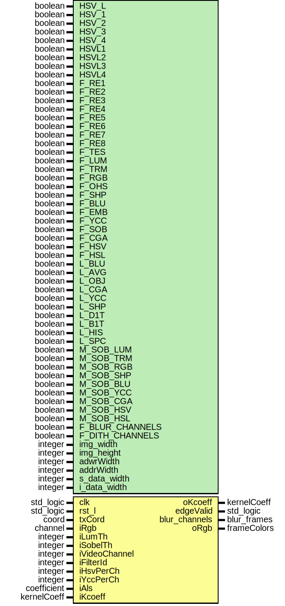

# Entity: filters 

- **File**: Filters.vhd
## Diagram

## Generics

| Generic name    | Type    | Value | Description |
| --------------- | ------- | ----- | ----------- |
| HSV_L           | boolean | false |             |
| HSV_1           | boolean | false |             |
| HSV_2           | boolean | false |             |
| HSV_3           | boolean | false |             |
| HSV_4           | boolean | false |             |
| HSVL1           | boolean | false |             |
| HSVL2           | boolean | false |             |
| HSVL3           | boolean | false |             |
| HSVL4           | boolean | false |             |
| F_RE1           | boolean | false |             |
| F_RE2           | boolean | false |             |
| F_RE3           | boolean | false |             |
| F_RE4           | boolean | false |             |
| F_RE5           | boolean | false |             |
| F_RE6           | boolean | false |             |
| F_RE7           | boolean | false |             |
| F_RE8           | boolean | false |             |
| F_TES           | boolean | false |             |
| F_LUM           | boolean | false |             |
| F_TRM           | boolean | false |             |
| F_RGB           | boolean | false |             |
| F_OHS           | boolean | false |             |
| F_SHP           | boolean | false |             |
| F_BLU           | boolean | false |             |
| F_EMB           | boolean | false |             |
| F_YCC           | boolean | false |             |
| F_SOB           | boolean | false |             |
| F_CGA           | boolean | false |             |
| F_HSV           | boolean | false |             |
| F_HSL           | boolean | false |             |
| L_BLU           | boolean | false |             |
| L_AVG           | boolean | false |             |
| L_OBJ           | boolean | false |             |
| L_CGA           | boolean | false |             |
| L_YCC           | boolean | false |             |
| L_SHP           | boolean | false |             |
| L_D1T           | boolean | false |             |
| L_B1T           | boolean | false |             |
| L_HIS           | boolean | false |             |
| L_SPC           | boolean | false |             |
| M_SOB_LUM       | boolean | false |             |
| M_SOB_TRM       | boolean | false |             |
| M_SOB_RGB       | boolean | false |             |
| M_SOB_SHP       | boolean | false |             |
| M_SOB_BLU       | boolean | false |             |
| M_SOB_YCC       | boolean | false |             |
| M_SOB_CGA       | boolean | false |             |
| M_SOB_HSV       | boolean | false |             |
| M_SOB_HSL       | boolean | false |             |
| F_BLUR_CHANNELS | boolean | false |             |
| F_DITH_CHANNELS | boolean | false |             |
| img_width       | integer | 4096  |             |
| img_height      | integer | 4096  |             |
| adwrWidth       | integer | 16    |             |
| addrWidth       | integer | 12    |             |
| s_data_width    | integer | 16    |             |
| i_data_width    | integer | 8     |             |
## Ports

| Port name     | Direction | Type        | Description |
| ------------- | --------- | ----------- | ----------- |
| clk           | in        | std_logic   |             |
| rst_l         | in        | std_logic   |             |
| txCord        | in        | coord       |             |
| iRgb          | in        | channel     |             |
| iLumTh        | in        | integer     |             |
| iSobelTh      | in        | integer     |             |
| iVideoChannel | in        | integer     |             |
| iFilterId     | in        | integer     |             |
| iHsvPerCh     | in        | integer     |             |
| iYccPerCh     | in        | integer     |             |
| iAls          | in        | coefficient |             |
| iKcoeff       | in        | kernelCoeff |             |
| oKcoeff       | out       | kernelCoeff |             |
| edgeValid     | out       | std_logic   |             |
| blur_channels | out       | blur_frames |             |
| oRgb          | out       | frameColors |             |
## Signals

| Name             | Type                  | Description |
| ---------------- | --------------------- | ----------- |
| rgbImageKernel   | colors                |             |
| rgbLocFilt       | local_filters         |             |
| rgbLocSynSFilt   | local_filters         |             |
| fRgb             | frameColors           |             |
| sEdgeValid       | std_logic             |             |
| ycbcrValid       | std_logic             |             |
| fRgb1            | colors                |             |
| fRgb2            | colors                |             |
| fRgb3            | colors                |             |
| cgainIoIn        | channel               |             |
| sharpIoIn        | channel               |             |
| blurIoIn         | channel               |             |
| YcbcrIoIn        | channel               |             |
| cgainIoOut       | channel               |             |
| cgainValidRgb    | channel               |             |
| sharpIoOut       | channel               |             |
| blurIoOut        | channel               |             |
| sharpIodValid    | channel               |             |
| blurIodValid     | channel               |             |
| YcbcrIoOut       | channel               |             |
| YcbcrIoOutSelect | channel               |             |
| blur1vx          | channel               |             |
| blur11x          | channel               |             |
| blur2vx          | channel               |             |
| blur21x          | channel               |             |
| blur3vx          | channel               |             |
| blur31x          | channel               |             |
| ditRgb1vx        | channel               |             |
| ditRgb2vx        | channel               |             |
| ditRgb3vx        | channel               |             |
| rgbSel           | channel               |             |
| vhsv             | channel               |             |
| vh1s             | channel               |             |
| vh2s             | channel               |             |
| vh3s             | channel               |             |
| rgb_hsvl         | channel               |             |
| rgb_histo        | channel               |             |
| eObject          | channel               |             |
| color_limits     | type_RgbArray(0 to 7) |             |
| valid_vhs        | std_logic             |             |
| dark_ccm         | coefficient           |             |
| light_ccm        | coefficient           |             |
| balance_ccm      | coefficient           |             |
| rgb              | channel               |             |
| rgbYcbcr         | channel               |             |
## Constants

| Name         | Type    | Value                                                                                                                                                                  | Description |
| ------------ | ------- | ---------------------------------------------------------------------------------------------------------------------------------------------------------------------- | ----------- |
| init_channel | channel | (valid => lo,  red => black,  green => black,  blue => black) |             |
## Processes
- lThSelectP: ( clk )
- CgainIoP: ( clk )
- SharpIoP: ( clk )
- BlurIoP: ( clk )
- YcbcrIoP: ( clk )
## Instantiations

- rgb_range_inst: rgb_range
- hsvl_ycc_inst: rgb_ycbcr
- edge_objectsInst: edge_objects
- filter_kernel_inst: kernel
- filter_colcor_inst: color_correction
- filter_sharpe_inst: sharp_filter
- sharp_f_valid_inst: d_valid
- filter_blur_5_inst: blur_filter
- blurr_f_valid_inst: d_valid
- filter_y_cbcr_inst: rgb_ycbcr
