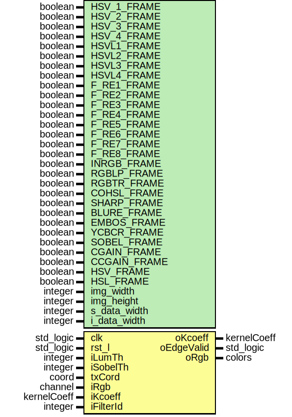

# Entity: kernel 

- **File**: Kernel.vhd
## Diagram

## Generics

| Generic name | Type    | Value | Description |
| ------------ | ------- | ----- | ----------- |
| HSV_1_FRAME  | boolean | false |             |
| HSV_2_FRAME  | boolean | false |             |
| HSV_3_FRAME  | boolean | false |             |
| HSV_4_FRAME  | boolean | false |             |
| HSVL1_FRAME  | boolean | false |             |
| HSVL2_FRAME  | boolean | false |             |
| HSVL3_FRAME  | boolean | false |             |
| HSVL4_FRAME  | boolean | false |             |
| F_RE1_FRAME  | boolean | false |             |
| F_RE2_FRAME  | boolean | false |             |
| F_RE3_FRAME  | boolean | false |             |
| F_RE4_FRAME  | boolean | false |             |
| F_RE5_FRAME  | boolean | false |             |
| F_RE6_FRAME  | boolean | false |             |
| F_RE7_FRAME  | boolean | false |             |
| F_RE8_FRAME  | boolean | false |             |
| INRGB_FRAME  | boolean | false |             |
| RGBLP_FRAME  | boolean | false |             |
| RGBTR_FRAME  | boolean | false |             |
| COHSL_FRAME  | boolean | false |             |
| SHARP_FRAME  | boolean | false |             |
| BLURE_FRAME  | boolean | false |             |
| EMBOS_FRAME  | boolean | false |             |
| YCBCR_FRAME  | boolean | false |             |
| SOBEL_FRAME  | boolean | false |             |
| CGAIN_FRAME  | boolean | false |             |
| CCGAIN_FRAME | boolean | false |             |
| HSV_FRAME    | boolean | false |             |
| HSL_FRAME    | boolean | false |             |
| img_width    | integer | 4096  |             |
| img_height   | integer | 4096  |             |
| s_data_width | integer | 16    |             |
| i_data_width | integer | 8     |             |
## Ports

| Port name  | Direction | Type        | Description |
| ---------- | --------- | ----------- | ----------- |
| clk        | in        | std_logic   |             |
| rst_l      | in        | std_logic   |             |
| iLumTh     | in        | integer     |             |
| iSobelTh   | in        | integer     |             |
| txCord     | in        | coord       |             |
| iRgb       | in        | channel     |             |
| iKcoeff    | in        | kernelCoeff |             |
| iFilterId  | in        | integer     |             |
| oKcoeff    | out       | kernelCoeff |             |
| oEdgeValid | out       | std_logic   |             |
| oRgb       | out       | colors      |             |
## Signals

| Name         | Type                          | Description |
| ------------ | ----------------------------- | ----------- |
| rgbMac1      | channel                       |             |
| rgbMac2      | channel                       |             |
| rgbMac3      | channel                       |             |
| rgbSyncValid | std_logic_vector(15 downto 0) |             |
| kCoProd      | kCoefFiltFloat                |             |
| colorhsl     | channel                       |             |
| ccmcolor     | channel                       |             |
| re1color     | channel                       |             |
| re2color     | channel                       |             |
| re3color     | channel                       |             |
| re4color     | channel                       |             |
| re5color     | channel                       |             |
| re6color     | channel                       |             |
| re7color     | channel                       |             |
| re8color     | channel                       |             |
| blurRgb      | channel                       |             |
| blurRgbSync  | channel                       |             |
| hslSyncr     | channel                       |             |
| hsl_1_Syncr  | channel                       |             |
| hsl_2_Syncr  | channel                       |             |
| hsl_3_Syncr  | channel                       |             |
| hsl_4_Syncr  | channel                       |             |
| hsll1_Syncr  | channel                       |             |
| hsll2_Syncr  | channel                       |             |
| hsll3_Syncr  | channel                       |             |
| hsll4_Syncr  | channel                       |             |
| hsl_1_range  | channel                       |             |
| hsl_2_range  | channel                       |             |
| hsl_3_range  | channel                       |             |
| hsl_4_range  | channel                       |             |
| hsll1_range  | channel                       |             |
| hsll2_range  | channel                       |             |
| hsll3_range  | channel                       |             |
| hsll4_range  | channel                       |             |
## Constants

| Name         | Type    | Value                                                                                                                                                                  | Description |
| ------------ | ------- | ---------------------------------------------------------------------------------------------------------------------------------------------------------------------- | ----------- |
| adwrWidth    | integer | 16                                                                                                                                                                     |             |
| addrWidth    | integer | 12                                                                                                                                                                     |             |
| init_channel | channel | (valid => lo,  red => black,  green => black,  blue => black) |             |
## Instantiations

- CoefMultInst: coef_mult
