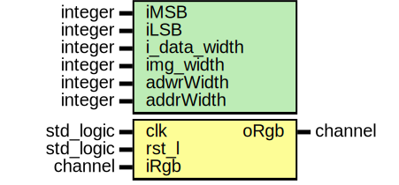

# Entity: blur_filter 

- **File**: blur_filter.vhd
## Diagram

## Generics

| Generic name | Type    | Value | Description |
| ------------ | ------- | ----- | ----------- |
| iMSB         | integer | 11    |             |
| iLSB         | integer | 4     |             |
| i_data_width | integer | 8     |             |
| img_width    | integer | 256   |             |
| adwrWidth    | integer | 16    |             |
| addrWidth    | integer | 12    |             |
## Ports

| Port name | Direction | Type      | Description |
| --------- | --------- | --------- | ----------- |
| clk       | in        | std_logic |             |
| rst_l     | in        | std_logic |             |
| iRgb      | in        | channel   |             |
| oRgb      | out       | channel   |             |
## Signals

| Name          | Type                          | Description |
| ------------- | ----------------------------- | ----------- |
| vTapRgb1      | std_logic_vector(23 downto 0) |             |
| vTapRgb2      | std_logic_vector(23 downto 0) |             |
| vTapRgb3      | std_logic_vector(23 downto 0) |             |
| dTapRgb1      | std_logic_vector(23 downto 0) |             |
| dTapRgb2      | std_logic_vector(23 downto 0) |             |
| dTapRgb3      | std_logic_vector(23 downto 0) |             |
| enable        | std_logic                     |             |
| d1En          | std_logic                     |             |
| d2En          | std_logic                     |             |
| d3Rgb         | std_logic_vector(23 downto 0) |             |
| rCountAddress | integer                       |             |
| rAddress      | std_logic_vector(15 downto 0) |             |
| rgb1x         | channel                       |             |
| rgb2x         | channel                       |             |
| rgb3x         | channel                       |             |
| blurRgb       | blurchannel                   |             |
## Processes
- tapValidAdressP: ( clk )
- tapSignedP: ( clk )
## Instantiations

- RGB_inst: buffer_controller
- MAC_R_inst: blur_mac
- MAC_G_inst: blur_mac
- MAC_B_inst: blur_mac
