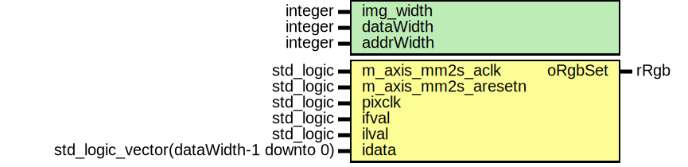

# Entity: camera_raw_to_rgb 

- **File**: camera_raw_to_rgb.vhd
## Diagram

## Generics

| Generic name | Type    | Value | Description |
| ------------ | ------- | ----- | ----------- |
| img_width    | integer | 8     |             |
| dataWidth    | integer | 12    |             |
| addrWidth    | integer | 12    |             |
## Ports

| Port name           | Direction | Type                                   | Description |
| ------------------- | --------- | -------------------------------------- | ----------- |
| m_axis_mm2s_aclk    | in        | std_logic                              |             |
| m_axis_mm2s_aresetn | in        | std_logic                              |             |
| pixclk              | in        | std_logic                              |             |
| ifval               | in        | std_logic                              |             |
| ilval               | in        | std_logic                              |             |
| idata               | in        | std_logic_vector(dataWidth-1 downto 0) |             |
| oRgbSet             | out       | rRgb                                   |             |
## Signals

| Name      | Type    | Description |
| --------- | ------- | ----------- |
| rawTp     | rTp     |             |
| rawData   | rData   |             |
| rgbSet    | rRgb    |             |
| raw2xData | r2xData |             |
| raw1xData | rData   |             |
## Processes
- channelOutP: ( m_axis_mm2s_aclk )
## Instantiations

- CameraRawDataInst: camera_raw_data
- dataTapsInst: data_taps
- RawToRgbInst: raw_to_rgb
