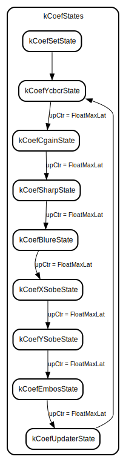

# Entity: coef_mult 

- **File**: coef_mult.vhd
## Diagram

## Ports

| Port name  | Direction | Type           | Description |
| ---------- | --------- | -------------- | ----------- |
| clk        | in        | std_logic      |             |
| rst_l      | in        | std_logic      |             |
| iKcoeff    | in        | kernelCoeff    |             |
| iFilterId  | in        | integer        |             |
| oKcoeff    | out       | kernelCoeff    |             |
| oCoeffProd | out       | kCoefFiltFloat |             |
## Signals

| Name         | Type                          | Description |
| ------------ | ----------------------------- | ----------- |
| kCoefStates  | kCoefSt                       |             |
| kCoefVals    | kCoefFilters                  |             |
| userCoefVals | kCoefFilters                  |             |
| kCoeffDWord  | kernelCoeDWord                |             |
| kCofFrtProd  | kernelCoeDWord                |             |
| upCtr        | integer                       |             |
| kCoeffValid  | std_logic                     |             |
| fractLevel   | std_logic_vector(31 downto 0) |             |
| kCof         | kernelCoeff                   |             |
## Constants

| Name          | Type                          | Value       | Description |
| ------------- | ----------------------------- | ----------- | ----------- |
| fractValue    | std_logic_vector(31 downto 0) | x"3a83126f" |             |
| rgbLevelValue | std_logic_vector(31 downto 0) | x"43800000" |             |
| FloatMaxLat   | integer                       | 20          |             |
## Types

| Name    | Type                                                                                                                                                                                                                                                                                                                                                                                                                                                                                                 | Description |
| ------- | ---------------------------------------------------------------------------------------------------------------------------------------------------------------------------------------------------------------------------------------------------------------------------------------------------------------------------------------------------------------------------------------------------------------------------------------------------------------------------------------------------- | ----------- |
| kCoefSt | (kCoefSetState, kCoefYcbcrState, kCoefCgainState, kCoefSharpState, kCoefBlureState, kCoefXSobeState, kCoefYSobeState, kCoefEmbosState, kCoefUpdaterState, kCoefIdleState) |             |
## Processes
- NewUserCoeffValuesP: ( clk )
- FloatMaxLatP: ( clk )
- kCoefStP: ( clk )
## Instantiations

- FloatMultiplyTopFractLevelInst: FloatMultiplyTop
- WordToFloatTopK1inst: WordToFloatTop
- WordToFloatTopK2inst: WordToFloatTop
- WordToFloatTopK3inst: WordToFloatTop
- WordToFloatTopK4inst: WordToFloatTop
- WordToFloatTopK5inst: WordToFloatTop
- WordToFloatTopK6inst: WordToFloatTop
- WordToFloatTopK7inst: WordToFloatTop
- WordToFloatTopK8inst: WordToFloatTop
- WordToFloatTopK9inst: WordToFloatTop
- FloatMultiplyTopK1Inst: FloatMultiplyTop
- FloatMultiplyTopK2Inst: FloatMultiplyTop
- FloatMultiplyTopK3Inst: FloatMultiplyTop
- FloatMultiplyTopK4Inst: FloatMultiplyTop
- FloatMultiplyTopK5Inst: FloatMultiplyTop
- FloatMultiplyTopK6Inst: FloatMultiplyTop
- FloatMultiplyTopK7Inst: FloatMultiplyTop
- FloatMultiplyTopK8Inst: FloatMultiplyTop
- FloatMultiplyTopK9Inst: FloatMultiplyTop
## State machines

