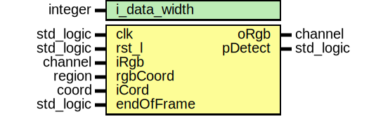

# Entity: detect_pixel 

- **File**: detect_pixel.vhd
## Diagram

## Generics

| Generic name | Type    | Value | Description |
| ------------ | ------- | ----- | ----------- |
| i_data_width | integer | 8     |             |
## Ports

| Port name  | Direction | Type      | Description |
| ---------- | --------- | --------- | ----------- |
| clk        | in        | std_logic |             |
| rst_l      | in        | std_logic |             |
| iRgb       | in        | channel   |             |
| oRgb       | out       | channel   |             |
| rgbCoord   | in        | region    |             |
| iCord      | in        | coord     |             |
| endOfFrame | in        | std_logic |             |
| pDetect    | out       | std_logic |             |
## Signals

| Name    | Type      | Description |
| ------- | --------- | ----------- |
| pEnable | std_logic |             |
| pCont   | cord      |             |
## Processes
- pixelRangeP: ( clk )
- pipCordP: ( clk )
## Instantiations

- pixelCordInt: pixel_cord
