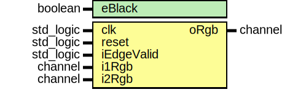

# Entity: frame_mask 

- **File**: frame_mask.vhd
## Diagram

## Generics

| Generic name | Type    | Value | Description |
| ------------ | ------- | ----- | ----------- |
| eBlack       | boolean | false |             |
## Ports

| Port name  | Direction | Type      | Description |
| ---------- | --------- | --------- | ----------- |
| clk        | in        | std_logic |             |
| reset      | in        | std_logic |             |
| iEdgeValid | in        | std_logic |             |
| i1Rgb      | in        | channel   |             |
| i2Rgb      | in        | channel   |             |
| oRgb       | out       | channel   |             |
## Signals

| Name         | Type                          | Description |
| ------------ | ----------------------------- | ----------- |
| d1Rgb        | channel                       |             |
| rgbSyncValid | std_logic_vector(15 downto 0) |             |
## Processes
- unnamed: ( clk )
## Instantiations

- SyncFrames32Inst: sync_frames
