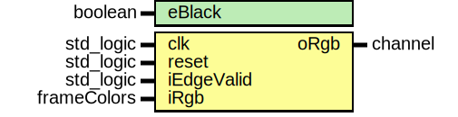

# Entity: frame_remake 

- **File**: frame_remake.vhd
## Diagram

## Generics

| Generic name | Type    | Value | Description |
| ------------ | ------- | ----- | ----------- |
| eBlack       | boolean | false |             |
## Ports

| Port name  | Direction | Type        | Description |
| ---------- | --------- | ----------- | ----------- |
| clk        | in        | std_logic   |             |
| reset      | in        | std_logic   |             |
| iEdgeValid | in        | std_logic   |             |
| iRgb       | in        | frameColors |             |
| oRgb       | out       | channel     |             |
## Signals

| Name            | Type    | Description |
| --------------- | ------- | ----------- |
| ycbcr           | channel |             |
| synYcbcr        | channel |             |
| iRgb_hsl1_range | channel |             |
| iRgb_hsll1range | channel |             |
| d1Rgb           | channel |             |
| d2Rgb           | channel |             |
| d3Rgb           | channel |             |
| d4Rgb           | channel |             |
| d5Rgb           | channel |             |
| d6Rgb           | channel |             |
| d7Rgb           | channel |             |
| d8Rgb           | channel |             |
| d21Rgb          | channel |             |
| d22Rgb          | channel |             |
| d23Rgb          | channel |             |
| d24Rgb          | channel |             |
| d25Rgb          | channel |             |
| d26Rgb          | channel |             |
| d27Rgb          | channel |             |
| d28Rgb          | channel |             |
## Processes
- unnamed: ( clk )
- unnamed: ( clk )
- unnamed: ( clk )
- unnamed: ( clk )
- unnamed: ( clk )
- unnamed: ( clk )
- unnamed: ( clk )
- unnamed: ( clk )
- unnamed: ( clk )
- unnamed: ( clk )
- unnamed: ( clk )
- unnamed: ( clk )
- unnamed: ( clk )
- unnamed: ( clk )
## Instantiations

- l_ycc_inst: rgb_ycbcr
- yccSyncr_inst: sync_frames
- iRgb_hsl1_range_inst: sync_frames
- iRgb_hsll1range_inst: sync_frames
- fframe_remake_s_cb_cr_inst: write_image
- fframe_remake_l_cb_cr_inst: write_image
- fframe_remake_s_l_cr_inst: write_image
- fframe_remake_ccr_s_cb_inst: write_image
- fframe_remake_ccr_s_cr_inst: write_image
- fframe_remake_ccr_s_l_inst: write_image
- frame_remake_h_cb_cr_inst: write_image
- frame_remake_s_cb_cr_inst: write_image
- frame_remake_l_cb_cr_inst: write_image
- frame_remake_h_cb_l_inst: write_image
- frame_remake_h_s_cr_inst: write_image
- frame_remake_ccr_h_cb_inst: write_image
- frame_remake_ccr_h_cr_inst: write_image
- frame_remake_ccr_h_s_inst: write_image
