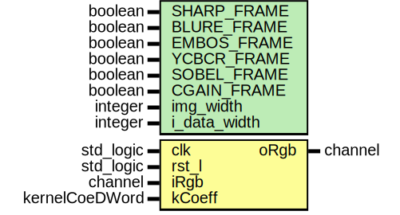

# Entity: kernel_core 

- **File**: kernel_core.vhd
## Diagram

## Generics

| Generic name | Type    | Value | Description |
| ------------ | ------- | ----- | ----------- |
| SHARP_FRAME  | boolean | false |             |
| BLURE_FRAME  | boolean | false |             |
| EMBOS_FRAME  | boolean | false |             |
| YCBCR_FRAME  | boolean | false |             |
| SOBEL_FRAME  | boolean | false |             |
| CGAIN_FRAME  | boolean | false |             |
| img_width    | integer | 4096  |             |
| i_data_width | integer | 8     |             |
## Ports

| Port name | Direction | Type           | Description |
| --------- | --------- | -------------- | ----------- |
| clk       | in        | std_logic      |             |
| rst_l     | in        | std_logic      |             |
| iRgb      | in        | channel        |             |
| kCoeff    | in        | kernelCoeDWord |             |
| oRgb      | out       | channel        |             |
## Signals

| Name      | Type                | Description |
| --------- | ------------------- | ----------- |
| taps      | TapsRecord          |             |
| rgb_float | rgbFloat            |             |
| rgbSum    | signed(12 downto 0) |             |
| snfixRgb  | rgbToSnSumTrRecord  |             |
## Instantiations

- rgb_kernal_prod_inst: rgb_kernal_prod
