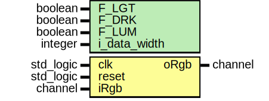

# Entity: lum_values 

- **File**: lum_values.vhd
## Diagram

## Generics

| Generic name | Type    | Value | Description |
| ------------ | ------- | ----- | ----------- |
| F_LGT        | boolean | false |             |
| F_DRK        | boolean | false |             |
| F_LUM        | boolean | false |             |
| i_data_width | integer | 8     |             |
## Ports

| Port name | Direction | Type      | Description |
| --------- | --------- | --------- | ----------- |
| clk       | in        | std_logic |             |
| reset     | in        | std_logic |             |
| iRgb      | in        | channel   |             |
| oRgb      | out       | channel   |             |
## Signals

| Name           | Type            | Description |
| -------------- | --------------- | ----------- |
| uFl1Rgb        | tpToFloatRecord |             |
| uFl2Rgb        | tpToFloatRecord |             |
| uFl3Rgb        | tpToFloatRecord |             |
| uFs4Rgb        | tpToFloatRecord |             |
| uFs5Rgb        | tpToFloatRecord |             |
| uFl6Rgb        | tpToFloatRecord |             |
| uFl7Rgb        | tpToFloatRecord |             |
| rgbMax         | float32         |             |
| rgbMin         | float32         |             |
| rgbxDeltaSum   | float32         |             |
| rgbxDeltaValue | float32         |             |
| rgbAvg1s       | float32         |             |
| rgbAvg2s       | float32         |             |
| rgbAvg3s       | float32         |             |
| rgbAvg4s       | float32         |             |
| rgbDark        | float32         |             |
| rgbBright      | float32         |             |
| rgb2xBright    | float32         |             |
| rgbBrightDark  | float32         |             |
| LumValue       | float32         |             |
| rgbLum         | float32         |             |
## Processes
- unnamed: ( clk,reset )
- unnamed: ( clk )
- unnamed: ( clk )
- unnamed: ( clk )
- unnamed: ( clk )
- unnamed: ( clk )
- unnamed: ( clk )
- unnamed: ( clk )
- unnamed: ( clk )
- unnamed: ( clk )
- unnamed: ( clk )
- unnamed: ( clk )
- unnamed: ( clk )
