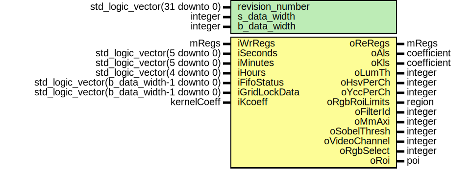

# Entity: mWrRd 

- **File**: mWrRd.vhd
## Diagram

## Generics

| Generic name    | Type                          | Value       | Description |
| --------------- | ----------------------------- | ----------- | ----------- |
| revision_number | std_logic_vector(31 downto 0) | x"00000000" |             |
| s_data_width    | integer                       | 16          |             |
| b_data_width    | integer                       | 32          |             |
## Ports

| Port name     | Direction | Type                                      | Description |
| ------------- | --------- | ----------------------------------------- | ----------- |
| iWrRegs       | in        | mRegs                                     |             |
| oReRegs       | out       | mRegs                                     |             |
| iSeconds      | in        | std_logic_vector(5 downto 0)              |             |
| iMinutes      | in        | std_logic_vector(5 downto 0)              |             |
| iHours        | in        | std_logic_vector(4 downto 0)              |             |
| iFifoStatus   | in        | std_logic_vector(b_data_width-1 downto 0) |             |
| iGridLockData | in        | std_logic_vector(b_data_width-1 downto 0) |             |
| iKcoeff       | in        | kernelCoeff                               |             |
| oAls          | out       | coefficient                               |             |
| oKls          | out       | coefficient                               |             |
| oLumTh        | out       | integer                                   |             |
| oHsvPerCh     | out       | integer                                   |             |
| oYccPerCh     | out       | integer                                   |             |
| oRgbRoiLimits | out       | region                                    |             |
| oFilterId     | out       | integer                                   |             |
| oMmAxi        | out       | integer                                   |             |
| oSobelThresh  | out       | integer                                   |             |
| oVideoChannel | out       | integer                                   |             |
| oRgbSelect    | out       | integer                                   |             |
| oRoi          | out       | poi                                       |             |
