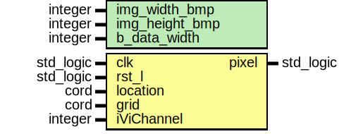

# Entity: pixel_on_display 

- **File**: pixel_on_display.vhd
## Diagram

## Generics

| Generic name   | Type    | Value | Description |
| -------------- | ------- | ----- | ----------- |
| img_width_bmp  | integer | 1920  |             |
| img_height_bmp | integer | 1080  |             |
| b_data_width   | integer | 32    |             |
## Ports

| Port name  | Direction | Type      | Description |
| ---------- | --------- | --------- | ----------- |
| clk        | in        | std_logic |             |
| rst_l      | in        | std_logic |             |
| location   | in        | cord      |             |
| grid       | in        | cord      |             |
| iViChannel | in        | integer   |             |
| pixel      | out       | std_logic |             |
## Signals

| Name                | Type                                    | Description |
| ------------------- | --------------------------------------- | ----------- |
| displayText         | string(1 to 5)                          |             |
| fontAddress         | integer                                 |             |
| charBitInRow        | std_logic_vector(FONT_WIDTH-1 downto 0) |             |
| charCode            | natural                                 |             |
| charCodeLen         | natural                                 |             |
| charPosition        | integer                                 |             |
| bit_position_enable | std_logic                               |             |
| bit_position_sync   | std_logic                               |             |
| bit_position        | natural range 0 to (FONT_WIDTH-1)       |             |
## Constants

| Name          | Type    | Value | Description |
| ------------- | ------- | ----- | ----------- |
| NU_MRGB_TYPES | natural | 40    |             |
## Processes
- videoOutP: ( clk )
- dSyncP: ( clk )
- pixelOn: ( clk )
## Instantiations

- FontRomInst: font_rom
