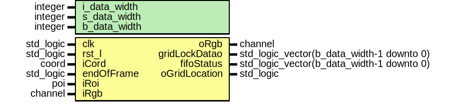
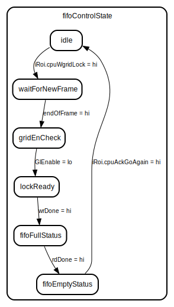

# Entity: point_of_interest 

- **File**: point_of_interest.vhd
## Diagram

## Generics

| Generic name | Type    | Value | Description |
| ------------ | ------- | ----- | ----------- |
| i_data_width | integer | 8     |             |
| s_data_width | integer | 16    |             |
| b_data_width | integer | 32    |             |
## Ports

| Port name     | Direction | Type                                      | Description |
| ------------- | --------- | ----------------------------------------- | ----------- |
| clk           | in        | std_logic                                 |             |
| rst_l         | in        | std_logic                                 |             |
| iCord         | in        | coord                                     |             |
| endOfFrame    | in        | std_logic                                 |             |
| iRoi          | in        | poi                                       |             |
| iRgb          | in        | channel                                   |             |
| oRgb          | out       | channel                                   |             |
| gridLockDatao | out       | std_logic_vector(b_data_width-1 downto 0) |             |
| fifoStatus    | out       | std_logic_vector(b_data_width-1 downto 0) |             |
| oGridLocation | out       | std_logic                                 |             |
## Signals

| Name             | Type                                          | Description |
| ---------------- | --------------------------------------------- | ----------- |
| fifoControlState | fState                                        |             |
| wrAddrsGlCtr     | integer                                       |             |
| GlEnable         | std_logic                                     |             |
| rdData           | std_logic_vector(23 downto 0)                 |             |
| wrDataIn         | std_logic_vector(23 downto 0)                 |             |
| clearData        | std_logic                                     |             |
| wrEn             | std_logic                                     |             |
| wrLstEn          | std_logic                                     |             |
| emptyO           | std_logic                                     |             |
| wrDone           | std_logic                                     |             |
| rdDone           | std_logic                                     |             |
| fullO            | std_logic                                     |             |
| clrStatus        | std_logic                                     |             |
| wrAddress        | std_logic_vector (FIFO_ADDR_WIDTH-1 downto 0) |             |
| wrAddr           | std_logic_vector (FIFO_ADDR_WIDTH-1 downto 0) |             |
| gridEn           | std_logic                                     |             |
| fifoIsFull       | std_logic                                     |             |
| fifoIsEmpty      | std_logic                                     |             |
| gridContMax      | std_logic_vector (15 downto 0)                |             |
| pCont            | cord                                          |             |
## Constants

| Name            | Type    | Value                | Description |
| --------------- | ------- | -------------------- | ----------- |
| FIFO_ADDR_WIDTH | integer | 14                   |             |
| FIFO_DATA_WIDTH | integer | 24                   |             |
| FIFO_DEPTH      | integer | 2**(FIFO_ADDR_WIDTH) |             |
## Types

| Name   | Type                                                                                                                                                                                                                                                            | Description |
| ------ | --------------------------------------------------------------------------------------------------------------------------------------------------------------------------------------------------------------------------------------------------------------- | ----------- |
| fState | (idle, lockReady, fifoFullStatus, fifoEmptyStatus, waitForNewFrame, gridEnCheck) |             |
## Processes
- fifoControlP: ( clk )
- enablePointerP: ( clk )
- pipCordP: ( clk )
## Instantiations

- gridLockFifoInt: grid_lock_fifo
- pixelCordInt: pixel_cord
## State machines

