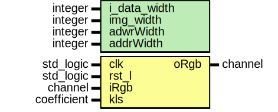

# Entity: sharp_filter 

- **File**: sharp_filter.vhd
## Diagram

## Generics

| Generic name | Type    | Value | Description |
| ------------ | ------- | ----- | ----------- |
| i_data_width | integer | 8     |             |
| img_width    | integer | 256   |             |
| adwrWidth    | integer | 16    |             |
| addrWidth    | integer | 12    |             |
## Ports

| Port name | Direction | Type        | Description |
| --------- | --------- | ----------- | ----------- |
| clk       | in        | std_logic   |             |
| rst_l     | in        | std_logic   |             |
| iRgb      | in        | channel     |             |
| kls       | in        | coefficient |             |
| oRgb      | out       | channel     |             |
## Signals

| Name          | Type                          | Description |
| ------------- | ----------------------------- | ----------- |
| vTapRGB0x     | std_logic_vector(23 downto 0) |             |
| vTapRGB1x     | std_logic_vector(23 downto 0) |             |
| vTapRGB2x     | std_logic_vector(23 downto 0) |             |
| v1TapRGB0x    | std_logic_vector(23 downto 0) |             |
| v1TapRGB1x    | std_logic_vector(23 downto 0) |             |
| v1TapRGB2x    | std_logic_vector(23 downto 0) |             |
| enable        | std_logic                     |             |
| d1en          | std_logic                     |             |
| d2en          | std_logic                     |             |
| d3en          | std_logic                     |             |
| d4en          | std_logic                     |             |
| d5en          | std_logic                     |             |
| rCountAddress | integer                       |             |
| rAddress      | std_logic_vector(15 downto 0) |             |
| rgb1x         | channel                       |             |
| rgb2x         | channel                       |             |
| d2RGB         | std_logic_vector(23 downto 0) |             |
## Processes
- tapValidAdressP: ( clk )
- tapSignedP: ( clk )
## Instantiations

- RGBInst: buffer_controller
- MACrInst: sharp_mac
- MACgInst: sharp_mac
- MACbInst: sharp_mac
