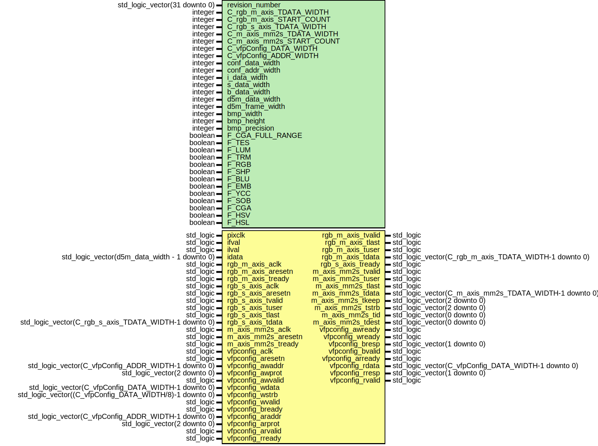

# Entity: VFP_v1_0 

- **File**: vfpTop.vhd
## Diagram

## Generics

| Generic name              | Type                          | Value       | Description |
| ------------------------- | ----------------------------- | ----------- | ----------- |
| revision_number           | std_logic_vector(31 downto 0) | x"03072020" |             |
| C_rgb_m_axis_TDATA_WIDTH  | integer                       | 16          |             |
| C_rgb_m_axis_START_COUNT  | integer                       | 32          |             |
| C_rgb_s_axis_TDATA_WIDTH  | integer                       | 16          |             |
| C_m_axis_mm2s_TDATA_WIDTH | integer                       | 16          |             |
| C_m_axis_mm2s_START_COUNT | integer                       | 32          |             |
| C_vfpConfig_DATA_WIDTH    | integer                       | 32          |             |
| C_vfpConfig_ADDR_WIDTH    | integer                       | 8           |             |
| conf_data_width           | integer                       | 32          |             |
| conf_addr_width           | integer                       | 8           |             |
| i_data_width              | integer                       | 8           |             |
| s_data_width              | integer                       | 16          |             |
| b_data_width              | integer                       | 32          |             |
| d5m_data_width            | integer                       | 12          |             |
| d5m_frame_width           | integer                       | 4096        |             |
| bmp_width                 | integer                       | 1920        |             |
| bmp_height                | integer                       | 1080        |             |
| bmp_precision             | integer                       | 12          |             |
| F_CGA_FULL_RANGE          | boolean                       | false       |             |
| F_TES                     | boolean                       | true        |             |
| F_LUM                     | boolean                       | false       |             |
| F_TRM                     | boolean                       | false       |             |
| F_RGB                     | boolean                       | true        |             |
| F_SHP                     | boolean                       | true        |             |
| F_BLU                     | boolean                       | false       |             |
| F_EMB                     | boolean                       | false       |             |
| F_YCC                     | boolean                       | true        |             |
| F_SOB                     | boolean                       | true        |             |
| F_CGA                     | boolean                       | true        |             |
| F_HSV                     | boolean                       | true        |             |
| F_HSL                     | boolean                       | true        |             |
## Ports

| Port name           | Direction | Type                                                    | Description |
| ------------------- | --------- | ------------------------------------------------------- | ----------- |
| pixclk              | in        | std_logic                                               |             |
| ifval               | in        | std_logic                                               |             |
| ilval               | in        | std_logic                                               |             |
| idata               | in        | std_logic_vector(d5m_data_width - 1 downto 0)           |             |
| rgb_m_axis_aclk     | in        | std_logic                                               |             |
| rgb_m_axis_aresetn  | in        | std_logic                                               |             |
| rgb_m_axis_tready   | in        | std_logic                                               |             |
| rgb_m_axis_tvalid   | out       | std_logic                                               |             |
| rgb_m_axis_tlast    | out       | std_logic                                               |             |
| rgb_m_axis_tuser    | out       | std_logic                                               |             |
| rgb_m_axis_tdata    | out       | std_logic_vector(C_rgb_m_axis_TDATA_WIDTH-1 downto 0)   |             |
| rgb_s_axis_aclk     | in        | std_logic                                               |             |
| rgb_s_axis_aresetn  | in        | std_logic                                               |             |
| rgb_s_axis_tready   | out       | std_logic                                               |             |
| rgb_s_axis_tvalid   | in        | std_logic                                               |             |
| rgb_s_axis_tuser    | in        | std_logic                                               |             |
| rgb_s_axis_tlast    | in        | std_logic                                               |             |
| rgb_s_axis_tdata    | in        | std_logic_vector(C_rgb_s_axis_TDATA_WIDTH-1 downto 0)   |             |
| m_axis_mm2s_aclk    | in        | std_logic                                               |             |
| m_axis_mm2s_aresetn | in        | std_logic                                               |             |
| m_axis_mm2s_tready  | in        | std_logic                                               |             |
| m_axis_mm2s_tvalid  | out       | std_logic                                               |             |
| m_axis_mm2s_tuser   | out       | std_logic                                               |             |
| m_axis_mm2s_tlast   | out       | std_logic                                               |             |
| m_axis_mm2s_tdata   | out       | std_logic_vector(C_m_axis_mm2s_TDATA_WIDTH-1 downto 0)  |             |
| m_axis_mm2s_tkeep   | out       | std_logic_vector(2 downto 0)                            |             |
| m_axis_mm2s_tstrb   | out       | std_logic_vector(2 downto 0)                            |             |
| m_axis_mm2s_tid     | out       | std_logic_vector(0 downto 0)                            |             |
| m_axis_mm2s_tdest   | out       | std_logic_vector(0 downto 0)                            |             |
| vfpconfig_aclk      | in        | std_logic                                               |             |
| vfpconfig_aresetn   | in        | std_logic                                               |             |
| vfpconfig_awaddr    | in        | std_logic_vector(C_vfpConfig_ADDR_WIDTH-1 downto 0)     |             |
| vfpconfig_awprot    | in        | std_logic_vector(2 downto 0)                            |             |
| vfpconfig_awvalid   | in        | std_logic                                               |             |
| vfpconfig_awready   | out       | std_logic                                               |             |
| vfpconfig_wdata     | in        | std_logic_vector(C_vfpConfig_DATA_WIDTH-1 downto 0)     |             |
| vfpconfig_wstrb     | in        | std_logic_vector((C_vfpConfig_DATA_WIDTH/8)-1 downto 0) |             |
| vfpconfig_wvalid    | in        | std_logic                                               |             |
| vfpconfig_wready    | out       | std_logic                                               |             |
| vfpconfig_bresp     | out       | std_logic_vector(1 downto 0)                            |             |
| vfpconfig_bvalid    | out       | std_logic                                               |             |
| vfpconfig_bready    | in        | std_logic                                               |             |
| vfpconfig_araddr    | in        | std_logic_vector(C_vfpConfig_ADDR_WIDTH-1 downto 0)     |             |
| vfpconfig_arprot    | in        | std_logic_vector(2 downto 0)                            |             |
| vfpconfig_arvalid   | in        | std_logic                                               |             |
| vfpconfig_arready   | out       | std_logic                                               |             |
| vfpconfig_rdata     | out       | std_logic_vector(C_vfpConfig_DATA_WIDTH-1 downto 0)     |             |
| vfpconfig_rresp     | out       | std_logic_vector(1 downto 0)                            |             |
| vfpconfig_rvalid    | out       | std_logic                                               |             |
| vfpconfig_rready    | in        | std_logic                                               |             |
## Signals

| Name       | Type        | Description |
| ---------- | ----------- | ----------- |
| sMmAxi     | integer     |             |
| rgb_set    | rRgb        |             |
| wr_regs    | mRegs       |             |
| rd_regs    | mRegs       |             |
| video_data | vStreamData |             |
## Constants

| Name      | Type    | Value | Description |
| --------- | ------- | ----- | ----------- |
| adwrWidth | integer | 16    |             |
| addrWidth | integer | 12    |             |
## Instantiations

- camera_raw_to_rgb_inst: camera_raw_to_rgb
- video_stream_inst: video_stream
- axis_external_inst: axis_external
