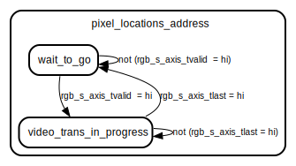

# Entity: vfp_m_axis 

- **File**: vfp_m_axis.vhd
## Diagram

## Generics

| Generic name | Type    | Value | Description |
| ------------ | ------- | ----- | ----------- |
| s_data_width | integer | 16    |             |
## Ports

| Port name          | Direction | Type                                       | Description |
| ------------------ | --------- | ------------------------------------------ | ----------- |
| aclk               | in        | std_logic                                  |             |
| aresetn            | in        | std_logic                                  |             |
| rgb_s_axis_tready  | out       | std_logic                                  |             |
| rgb_s_axis_tvalid  | in        | std_logic                                  |             |
| rgb_s_axis_tuser   | in        | std_logic                                  |             |
| rgb_s_axis_tlast   | in        | std_logic                                  |             |
| rgb_s_axis_tdata   | in        | std_logic_vector(s_data_width-1  downto 0) |             |
| m_axis_mm2s_tkeep  | out       | std_logic_vector(2 downto 0)               |             |
| m_axis_mm2s_tstrb  | out       | std_logic_vector(2 downto 0)               |             |
| m_axis_mm2s_tid    | out       | std_logic_vector(0 downto 0)               |             |
| m_axis_mm2s_tdest  | out       | std_logic_vector(0 downto 0)               |             |
| m_axis_mm2s_tready | in        | std_logic                                  |             |
| m_axis_mm2s_tvalid | out       | std_logic                                  |             |
| m_axis_mm2s_tuser  | out       | std_logic                                  |             |
| m_axis_mm2s_tlast  | out       | std_logic                                  |             |
| m_axis_mm2s_tdata  | out       | std_logic_vector(s_data_width-1 downto 0)  |             |
## Signals

| Name                    | Type                                      | Description |
| ----------------------- | ----------------------------------------- | ----------- |
| pixel_locations_address | pixel_locations                           |             |
| axis_tvalid             | std_logic                                 |             |
| axis_tuser              | std_logic                                 |             |
| axis_tlast              | std_logic                                 |             |
| axis_tdata              | std_logic_vector(s_data_width-1 downto 0) |             |
| maxis_mm2s_tdata        | std_logic_vector(s_data_width-1 downto 0) |             |
| maxis_mm2s_tuser        | std_logic                                 |             |
| maxis_mm2s_tvalid       | std_logic                                 |             |
| maxis_mmss_tvalid       | std_logic                                 |             |
| mm2s_tready             | std_logic                                 |             |
## Types

| Name            | Type                                                                     | Description |
| --------------- | ------------------------------------------------------------------------ | ----------- |
| pixel_locations | (video_trans_in_progress, wait_to_go) |             |
## Processes
- unnamed: ( aclk )
- unnamed: ( aclk )
- unnamed: ( aclk )
- unnamed: ( aclk )
## State machines

