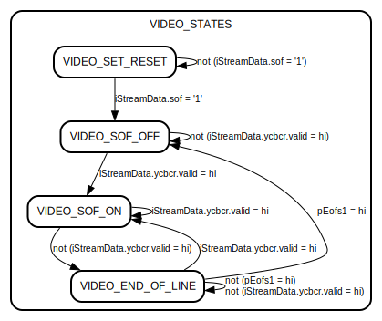

# Entity: vfp_s_axis 

- **File**: vfp_s_axis.vhd
## Diagram

## Generics

| Generic name | Type    | Value | Description |
| ------------ | ------- | ----- | ----------- |
| i_data_width | integer | 8     |             |
| b_data_width | integer | 32    |             |
| s_data_width | integer | 16    |             |
## Ports

| Port name           | Direction | Type                                      | Description |
| ------------------- | --------- | ----------------------------------------- | ----------- |
| m_axis_mm2s_aclk    | in        | std_logic                                 |             |
| m_axis_mm2s_aresetn | in        | std_logic                                 |             |
| iMmAxi              | in        | integer                                   |             |
| iStreamData         | in        | vStreamData                               |             |
| rx_axis_tready_o    | in        | std_logic                                 |             |
| rx_axis_tvalid      | out       | std_logic                                 |             |
| rx_axis_tuser       | out       | std_logic                                 |             |
| rx_axis_tlast       | out       | std_logic                                 |             |
| rx_axis_tdata       | out       | std_logic_vector(s_data_width-1 downto 0) |             |
| rgb_m_axis_tvalid   | out       | std_logic                                 |             |
| rgb_m_axis_tlast    | out       | std_logic                                 |             |
| rgb_m_axis_tuser    | out       | std_logic                                 |             |
| rgb_m_axis_tready   | in        | std_logic                                 |             |
| rgb_m_axis_tdata    | out       | std_logic_vector(s_data_width-1 downto 0) |             |
| rgb_s_axis_tready   | out       | std_logic                                 |             |
| rgb_s_axis_tvalid   | in        | std_logic                                 |             |
| rgb_s_axis_tuser    | in        | std_logic                                 |             |
| rgb_s_axis_tlast    | in        | std_logic                                 |             |
| rgb_s_axis_tdata    | in        | std_logic_vector(s_data_width-1 downto 0) |             |
## Signals

| Name           | Type                                      | Description |
| -------------- | ----------------------------------------- | ----------- |
| sMmAxi         | integer                                   |             |
| axis_sof       | std_logic                                 |             |
| mpeg42XCR      | std_logic_vector(i_data_width-1 downto 0) |             |
| mpeg42XBR      | std_logic                                 |             |
| mpeg42XXX      | std_logic                                 |             |
| tx_axis_tvalid | std_logic                                 |             |
| tx_axis_tlast  | std_logic                                 |             |
| tx_axis_tuser  | std_logic                                 |             |
| tx_axis_tready | std_logic                                 |             |
| pEofs1         | std_logic                                 |             |
| tx_axis_tdata  | std_logic_vector(s_data_width-1 downto 0) |             |
| VIDEO_STATES   | video_io_state                            |             |
| nrowdist       | natural range 0 to 4096                   |             |
## Types

| Name           | Type                                                                                                                                                                       | Description |
| -------------- | -------------------------------------------------------------------------------------------------------------------------------------------------------------------------- | ----------- |
| video_io_state | (VIDEO_SET_RESET, VIDEO_SOF_OFF, VIDEO_SOF_ON, VIDEO_END_OF_LINE) |             |
## Processes
- unnamed: ( m_axis_mm2s_aclk )
- unnamed: ( m_axis_mm2s_aclk )
- unnamed: ( m_axis_mm2s_aclk )
- unnamed: ( m_axis_mm2s_aclk )
## State machines

