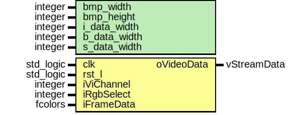

# Entity: video_select 

- **File**: video_select.vhd
## Diagram

## Generics

| Generic name | Type    | Value | Description |
| ------------ | ------- | ----- | ----------- |
| bmp_width    | integer | 1920  |             |
| bmp_height   | integer | 1080  |             |
| i_data_width | integer | 8     |             |
| b_data_width | integer | 32    |             |
| s_data_width | integer | 16    |             |
## Ports

| Port name  | Direction | Type        | Description |
| ---------- | --------- | ----------- | ----------- |
| clk        | in        | std_logic   |             |
| rst_l      | in        | std_logic   |             |
| iViChannel | in        | integer     |             |
| iRgbSelect | in        | integer     |             |
| iFrameData | in        | fcolors     |             |
| oVideoData | out       | vStreamData |             |
## Signals

| Name     | Type    | Description |
| -------- | ------- | ----------- |
| ycbcr    | channel |             |
| channels | channel |             |
| location | cord    |             |
| rgbText  | channel |             |
| sCord    | coord   |             |
| sRgb     | channel |             |
## Processes
- videoOutP: ( clk )
- unnamed: ( clk )
- channelOutP: ( clk )
## Instantiations

- ycbcrInst: rgb_ycbcr
- TextGenYcbcrInst: text_gen
