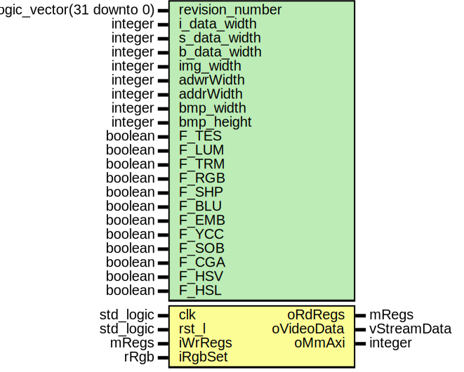

# Entity: video_stream 

- **File**: video_stream.vhd
## Diagram

## Generics

| Generic name    | Type                          | Value       | Description |
| --------------- | ----------------------------- | ----------- | ----------- |
| revision_number | std_logic_vector(31 downto 0) | x"00000000" |             |
| i_data_width    | integer                       | 8           |             |
| s_data_width    | integer                       | 16          |             |
| b_data_width    | integer                       | 32          |             |
| img_width       | integer                       | 256         |             |
| adwrWidth       | integer                       | 16          |             |
| addrWidth       | integer                       | 12          |             |
| bmp_width       | integer                       | 1920        |             |
| bmp_height      | integer                       | 1080        |             |
| F_TES           | boolean                       | false       |             |
| F_LUM           | boolean                       | false       |             |
| F_TRM           | boolean                       | false       |             |
| F_RGB           | boolean                       | false       |             |
| F_SHP           | boolean                       | false       |             |
| F_BLU           | boolean                       | false       |             |
| F_EMB           | boolean                       | false       |             |
| F_YCC           | boolean                       | false       |             |
| F_SOB           | boolean                       | false       |             |
| F_CGA           | boolean                       | false       |             |
| F_HSV           | boolean                       | false       |             |
| F_HSL           | boolean                       | false       |             |
## Ports

| Port name  | Direction | Type        | Description |
| ---------- | --------- | ----------- | ----------- |
| clk        | in        | std_logic   |             |
| rst_l      | in        | std_logic   |             |
| iWrRegs    | in        | mRegs       |             |
| oRdRegs    | out       | mRegs       |             |
| iRgbSet    | in        | rRgb        |             |
| oVideoData | out       | vStreamData |             |
| oMmAxi     | out       | integer     |             |
## Signals

| Name          | Type                                      | Description |
| ------------- | ----------------------------------------- | ----------- |
| sSec          | std_logic_vector(i_data_width-3 downto 0) |             |
| sMin          | std_logic_vector(i_data_width-3 downto 0) |             |
| sHou          | std_logic_vector(i_data_width/2 downto 0) |             |
| sFifoStatus   | std_logic_vector(b_data_width-1 downto 0) |             |
| sGridLockData | std_logic_vector(b_data_width-1 downto 0) |             |
| sRgbRoiLimits | region                                    |             |
| sRoi          | poi                                       |             |
| sFrameData    | fcolors                                   |             |
| sKls          | coefficient                               |             |
| sAls          | coefficient                               |             |
| sKcoeff       | kernelCoeff                               |             |
| sSobelThresh  | integer                                   |             |
| sViChannel    | integer                                   |             |
| sRgbSelect    | integer                                   |             |
| sFilterId     | integer                                   |             |
| sLumTh        | integer                                   |             |
| sHsvPerCh     | integer                                   |             |
| sYccPerCh     | integer                                   |             |
## Instantiations

- frameProcessInst: frame_process
- digiClkInst: digital_clock
- mWrRdInst: mWrRd
- videoSelectInst: video_select
